# Test_LuizPrina

**Steps for Setup**

**1 - Install Docker Desktop on your machine by following the steps on the links below:**

Windows: https://docs.docker.com/desktop/windows/install/

Mac: https://docs.docker.com/desktop/mac/install/

To check your Docker version, use the command:

```bash
docker --version
```


2 - Enable Kubernetes :

Docker Desktop includes a standalone Kubernetes server that runs on your local machine. 
Right before you enable it, you need to adjust
the resources a little bit from the initial default configuration. (Settings -> Resources)

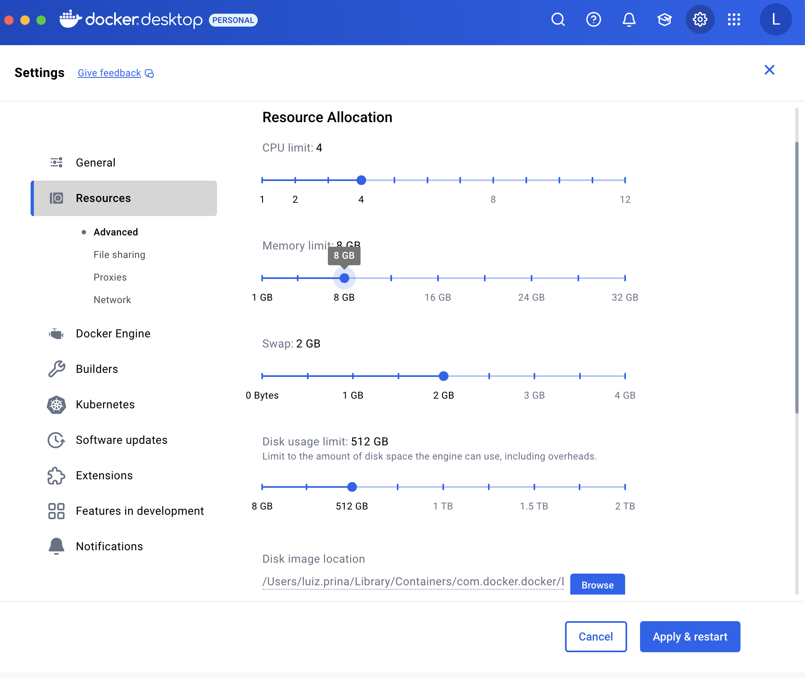

To enable Kubernetes on Docker Desktop:

- Open Docker Desktop settings.
- Find the Kubernetes section.
- Check the box that says “Enable Kubernetes”.
- Check the 'kubeadm' option
- Click “Apply & Restart” to save the changes.

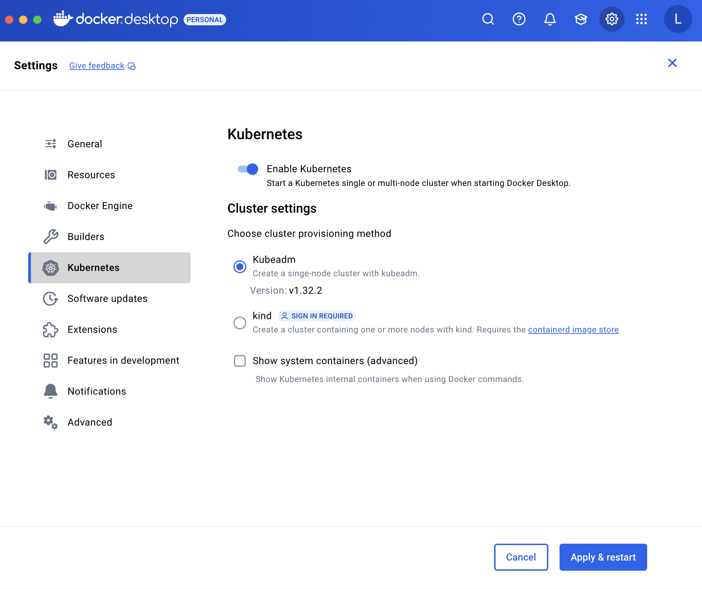


Click on Install button:

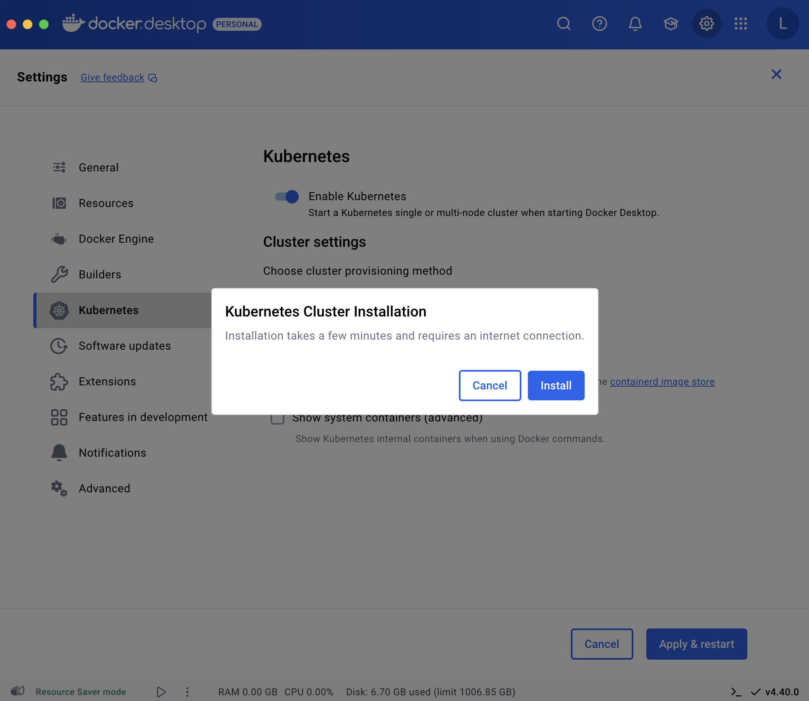

**3 - Getting kubectl installed on your PC:**

For macOS:
Homebrew: If you have Homebrew installed, you can simply run:

```bash
brew install kubectl
```

For Windows:
Chocolatey: If you use Chocolatey as your package manager, you can install 
kubetcl by running:

```bash
choco install kubernetes-cli
```
After the installation, you can verify the installation by running

```bash
kubectl version
```
**4 - Configure Kubernetes Context**
- Kubernetes uses contexts to access different clusters. Docker Desktop sets a context named docker-desktop.
- To switch to this context, use:

```bash
kubectl config use-context docker-desktop.
```
**5 - Getting Helm Chart installed on your PC**

For macOS:
Homebrew: If you have Homebrew installed, you can simply run:
```bash
brew install helm
```

For Windows:
Chocolatey: If you use Chocolatey as your package manager, you can install Helm by running:

```bash
choco install kubernetes-helm
```
 **6 - Deploy Kafka (Bitnami)**

6.1:Add Helm repo and upodate:
```bash
helm repo add bitnami https://charts.bitnami.com/bitnami
helm repo update
```
6.2: Install Kafka using Helm:

```bash
 helm install kafka bitnami/kafka -f ./yaml/kafka-values.yaml --namespace kafka --create-namespace
```

You can see an output like this:

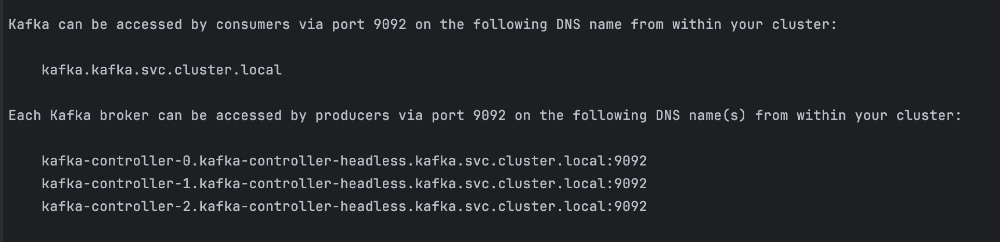

6.3: Check the services to ensure that Kafka Is accessible:

```bash
kubectl get svc -n kafka
```

The output should be:

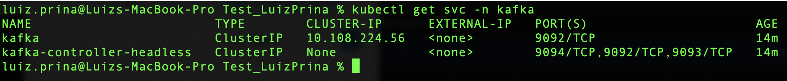

**7 - Deploy Spark** 

7.1: Create a namespace for spark:
```bash
kubectl create namespace spark
```

7.2: Install Spark using Helm:

```bash
 helm install spark bitnami/spark -f ./yaml/spark-values.yaml --namespace spark
```

7.3: Enable de UI:

```bash
kubectl port-forward --namespace spark svc/spark-master-svc 8080:80
```

**7.4: Test a job:**

```bash
 ./scripts/run_spark_example.sh
```

**7.5: You may see the following GUI when you access 127.0.0.1:8080**

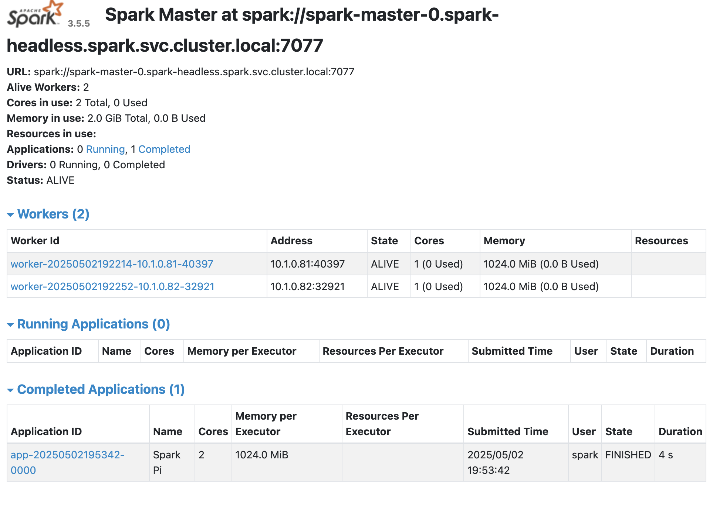


```

**6 - Deploying Kubernetes Dashboard**

Kubernetes Dashboard provides a user-friendly web-based interface to manage your Kubernetes cluster. 
It allows you to view and manage your cluster resources and applications, and also provides basic troubleshooting capabilities. 
Here’s how you can deploy the Kubernetes Dashboard:

**Step 6.1: Deploy the Dashboard**

Run the Deployment Command: To deploy the Kubernetes Dashboard, use kubectl to deploy the yaml 
configuration:

```bash
kubectl apply -f ./yaml/recommended-dashboard.yaml
```

This command downloads and applies the recommended deployment configuration from the Kubernetes Dashboard’s GitHub repository. 
And what you’ll see should look like this.

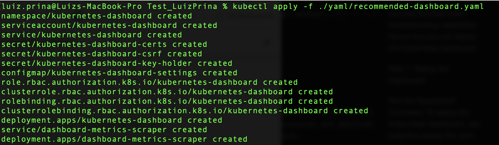

**Step 6.2: Access the Dashboard**

Start the Proxy: The Kubernetes Dashboard is accessed via a proxy server. 
Start the proxy (inside the /Test_LuizPrinaw folder) with the following command:

```bash
./scripts/start_kubectl_proxy.sh 
```
PS:Script file was uploaded with +x permission, but in case something goes wrong:

```bash
chmod +x ./scripts/start_kubectl_proxy.sh && ./scripts/start_kubectl_proxy.sh

```

You are going to see these:

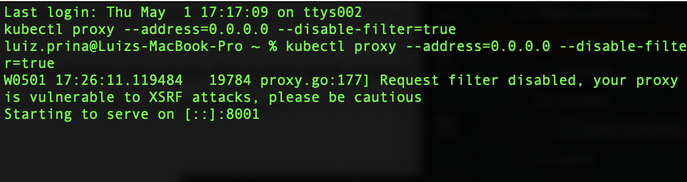

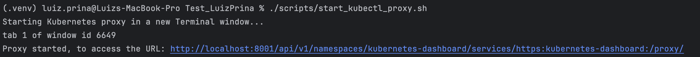

Click on the link above to be redirected to the following page:

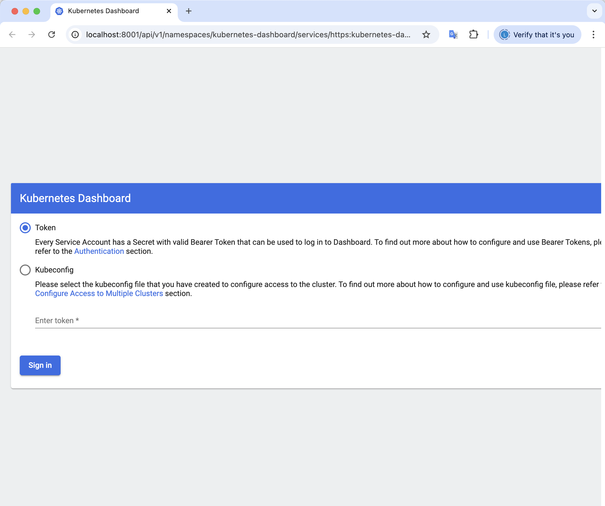

**Step 6.3: Authenticate to the Dashboard**
Get a Bearer Token: To log in to the Dashboard, you need to generate a bearer token. 
You can create a service account and get a token by following these steps:

```bash
kubectl apply -f ./yaml/dashboard-adminuser.yaml
kubectl apply -f ./yaml/dashboard-clusterrole.yaml
kubectl apply -f ./yaml/dashboard-secret.yaml
```

And to generate the token that will be used to access the dashboard, you can run:

```bash
kubectl get secret admin-user -n kubernetes-dashboard -o jsonpath={".data.token"} | base64 -d
```

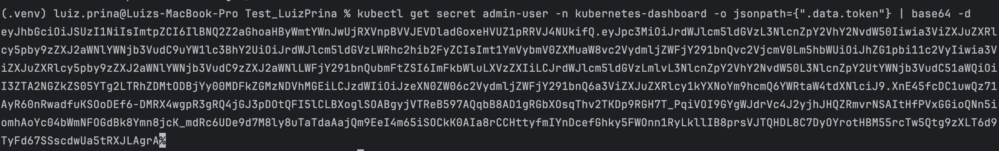

PLEASE NOTE ⚠️:
At the end of the token generated is a % symbol, ensure you copy the token without including the 
percentage symbol for correctness!

Next, use the token to login to the dashboard:

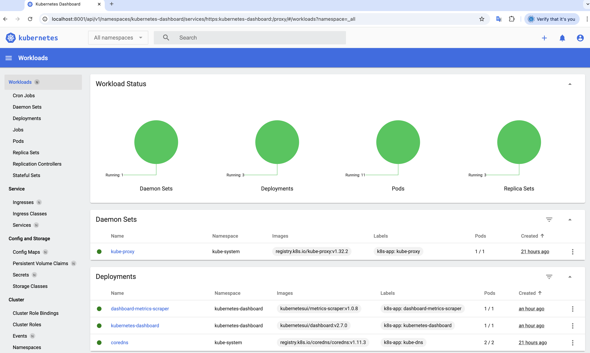


